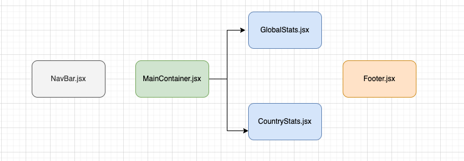

<h1 align="center">
  <br>
    
    <br>
    <br>
  Inman Code Sample
  <br>
</h1>

## Description

Hi, the core root of what I wanted to show was a very simple application demonstrating Coronavirus statistics globally and by continent/region. The application itself is very simple, but I wanted to demonstrate a significant amount of separation of concerns in not only the code, but also the file layout and structure.

I employed CSS modules to ensure there are no overlaps in classNames, and designed custom helper functions that any knowledgeable developer would be able to use if necessary, as it demonstrates my experience working in enterprise level environments. I'm a genuine believer in creating codebases that any other engineer could build on top, and essentially run with no issues.

The data itself comes from two APIs that are called using asynchronous functions in the MainContainer.jsx file and the respective data is prop drilled down to their components as noted by the Component Flow diagram below.

Personally my biggest challenge was around midway on Friday for some odd reason the code started to crash any browser, and I had to use a previous commit to ensure that we wouldn't keep on crashing halfway. Regrettably, I wish I had some more time to add better design and flair to the overall application, however, I didn't want to delay this submission any longer.

As always, grateful for the opportunity, I bring heart and passion to any team; thank you again.

<br>

<h1 align='center'> <br>Component Flow<br> </h1>

<h1 align='center'></h1>

<br>

## Getting Started

### Clone this repository

```bash
git clone https://github.com/davidkim7773/covid-stats.git
```

### Install dependencies

```bash
npm install
```

### Run in development

```bash
npm run dev
```
